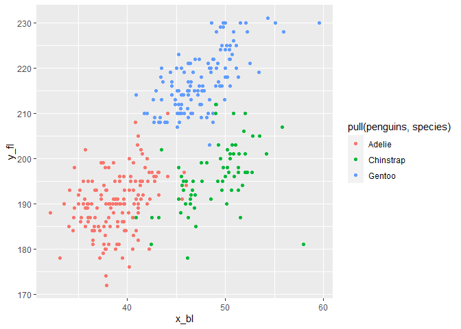

Homework 1
================
Yanhao Li

This is my solution to HW1.

``` r
library(tidyverse)
```

    ## -- Attaching packages ----------------------------------------------------------------------- tidyverse 1.3.0 --

    ## v ggplot2 3.3.2     v purrr   0.3.4
    ## v tibble  3.0.3     v dplyr   1.0.2
    ## v tidyr   1.1.2     v stringr 1.4.0
    ## v readr   1.3.1     v forcats 0.5.0

    ## -- Conflicts -------------------------------------------------------------------------- tidyverse_conflicts() --
    ## x dplyr::filter() masks stats::filter()
    ## x dplyr::lag()    masks stats::lag()

## Problem 1

Create a data frame with the specified elements.

``` r
prob1_df =
  tibble(
    random_sample = rnorm(10),
    random_sample_gt_0 = random_sample > 0,
    character_vector = c("a", "b", "c", "d", "e", "f", "g", "h", "i", "j"),
    factor_vector = factor(c("low", "low", "high", "mod", "high", "mod", "low", "low", "low", "high"))
  )
```

Take the mean of each variable in my data frame.

``` r
mean(pull(prob1_df, random_sample))
```

    ## [1] -0.03591314

``` r
mean(pull(prob1_df, random_sample_gt_0))
```

    ## [1] 0.4

``` r
mean(pull(prob1_df, character_vector))
```

    ## Warning in mean.default(pull(prob1_df, character_vector)): argument is not
    ## numeric or logical: returning NA

    ## [1] NA

``` r
mean(pull(prob1_df, factor_vector))
```

    ## Warning in mean.default(pull(prob1_df, factor_vector)): argument is not numeric
    ## or logical: returning NA

    ## [1] NA

I can take the mean of numbers and logical but not character or factor.

Convert variables from one type to another.

``` r
as.numeric(pull(prob1_df, random_sample_gt_0))
```

    ##  [1] 1 0 0 1 0 1 0 0 0 1

``` r
as.numeric(pull(prob1_df, character_vector))
```

    ## Warning: NAs introduced by coercion

    ##  [1] NA NA NA NA NA NA NA NA NA NA

``` r
as.numeric(pull(prob1_df, factor_vector))
```

    ##  [1] 2 2 1 3 1 3 2 2 2 1

I can convert the variables of logical and factor but not character.

R treat “FALSE” as 0 and “TRUE” as 1. It could sometimes assign numbers
to factor levels. This helps explain what happens when I take the mean.

Convert logical vector, and multiply the random sample by the result.

``` r
as.numeric(pull(prob1_df, random_sample_gt_0))*pull(prob1_df, random_sample)
```

    ##  [1] 0.4248220 0.0000000 0.0000000 0.2982386 0.0000000 1.2297994 0.0000000
    ##  [8] 0.0000000 0.0000000 1.8780228

``` r
as.factor(pull(prob1_df, random_sample_gt_0))*pull(prob1_df, random_sample)
```

    ## Warning in Ops.factor(as.factor(pull(prob1_df, random_sample_gt_0)),
    ## pull(prob1_df, : '*' not meaningful for factors

    ##  [1] NA NA NA NA NA NA NA NA NA NA

``` r
as.numeric(as.factor(pull(prob1_df, random_sample_gt_0)))*pull(prob1_df, random_sample)
```

    ##  [1]  0.8496440 -0.6766388 -0.1886039  0.5964772 -0.2113747  2.4595988
    ##  [7] -1.1396858 -1.3556032 -0.6181079  3.7560455

## Problem 2

Load the penguins dataset.

``` r
data("penguins", package = "palmerpenguins")
```

The short description of the penguins dataset:

It includes important variables named as species, island,
bill\_length\_mm, bill\_depth\_mm, flipper\_length\_mm, body\_mass\_g,
sex, year.

The range of bill length is 27.5 mm.

The range of bill depth is 8.4 mm.

The range of flipper length is 59 mm.

The range of body mass is 3600 g.

It has 344 rows and 8 columns.

The mean flipper length is 200.9152047 mm.

Create the dataframe containing variables for scatterplot.

``` r
set.seed(1234)

plot_df = tibble(
  x_bl = pull(penguins, bill_length_mm),
  y_fl = pull(penguins, flipper_length_mm)
)
```

Plot the scatterplot of `y_fl` vs `x_bl`.

``` r
ggplot(plot_df, aes(x = x_bl, y = y_fl, color = pull(penguins, species), na.rm = TRUE)) + geom_point()
```

    ## Warning: Removed 2 rows containing missing values (geom_point).

<!-- -->

Export scatterplot to project directory.

``` r
ggsave(file="penguins.pdf")
```

    ## Saving 7 x 5 in image

    ## Warning: Removed 2 rows containing missing values (geom_point).
